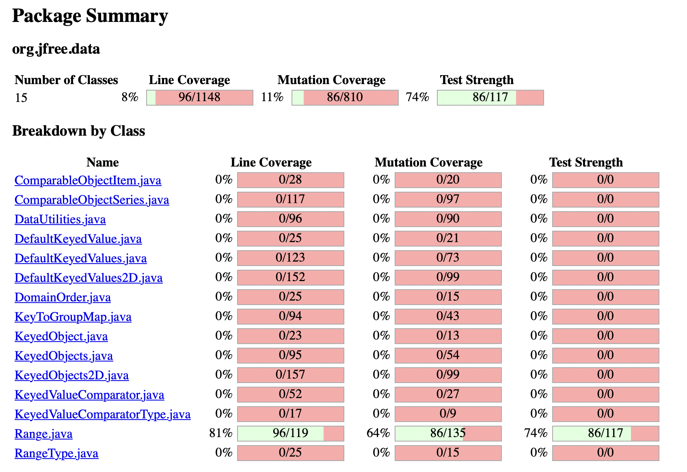
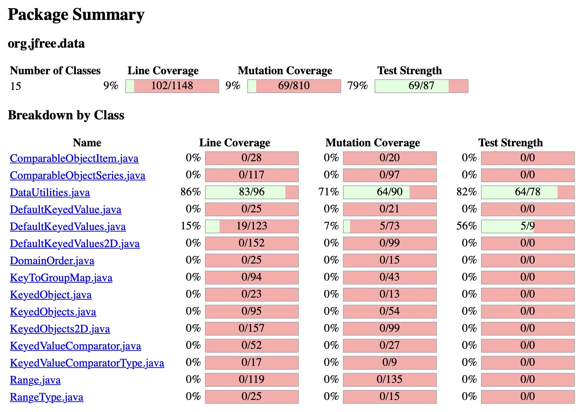

**SENG 637 - Dependability and Reliability of Software Systems**

**Lab. Report \#4 – Mutation Testing and Web app testing**

| Group \#: 5     |     |
| -------------- | --- |
| Student Names: |     |
| Christopher Proc               |     |
| Sean Buchanan               |     |
| Christopher Brunet               |     |

# Introduction

The focus of this lab is on Mutation Testing and GUI Testing. Mutants will be injected into the JFreeChart classes used in Assignment 3 and will be tested against the test cases written for Assignment 3. The GUI testing will be completed on a website using the Selenium IDE. 

# Analysis of 10 Mutants of the Range class 

Killed (5):

1.

    public double getLowerBound() {
        if (lower > upper) {
            String msg = "Range(double, double): require lower (" + lower
                + ") <= upper (" + upper + ").";
            throw new IllegalArgumentException(msg);
        }
        return this.lower;
    }

2.

    public double getLowerBound() {
        if (lower > upper) {
            String msg = "Range(double, double): require lower (" + lower
                + ") <= upper (" + upper + ").";
            throw new IllegalArgumentException(msg);
        }
        return this.lower;
    }

    

# Report all the statistics and the mutation score for each test class

Initial Mutation Score of Range Tests:

Initial Mutation Score of DataUtilities Tests:

# Analysis drawn on the effectiveness of each of the test classes

# A discussion on the effect of equivalent mutants on mutation score accuracy

# A discussion of what could have been done to improve the mutation score of the test suites

# Why do we need mutation testing? Advantages and disadvantages of mutation testing

By introducing small alterations to the source code, mutation testing evaluates the effectiveness of existing test cases in detecting these changes. This process helps uncover weaknesses in the test suite, ensuring that the tests are thorough and capable of catching potential bugs.

One advantage of mutation testing is its ability to identify redundant or ineffective test cases, leading to more efficient testing strategies. Additionally, it promotes a deeper understanding of the codebase and encourages developers to write more resilient tests.

A disadvantage of mutation testing is that it can be computationally intensive and time-consuming, especially for large codebases, which may deter its widespread adoption.

# Explain your SELENUIM test case design process

Test cases were written to assess unique functionalities of the SUT (Shop Smart Canada Website). Some of the core functionalities examined were:
- User Profile Functionality
    - Log In
    - Edit Account Details
    - Sign Out
- Shopping Functionality
    - Adding products to cart
    - Editing cart
    - Proceding to checkout
- Product Search Functionality

For each of these functionalities, various tests were designed to ensure the GUI responded to events appropriately. 

In designing each test case, the team performed each of the functionalities on the SUT to gain an understanding of expected behaviour. Once this exploration was complete, functionalities were split into numerous tests which allowed for better error tracking and readability of test cases (For example, the shopping functionality, which consists of adding a product to a cart, updating the quantity of items in the cart, then proceding to checkout was split into 3 tests).

# Explain the use of assertions and checkpoints

Assertions were used in each test case to ensure the expected result occured for each test. Various types of assertions were used. For example, when updating the quantity of items in the cart, assert text was used to ensure the change had been reflected in the checkout price. A different example would be for when a user signs in, assert title was used to ensure the user was directed to the appropriate next page.

# how did you test each functionaity with different test data

Each functionality was tested with various test data to ensure a certain degree of robustness when possible. Examples of this include creating tests to asses the result of both valid login credentials and invalid credentials. Another example for the search function was to test a valid product which returns many results as well as incoherent text which should be expected to return 0 results.

# How the team work/effort was divided and managed

Part 1: 
This section was completed synchronously by the entire group. The team ran the Pit Mutation Tests, analyzed the results based on the test cases written in assignment 3, and analyzed 10 different mutants killed or survived by Range tests. Finally, the group implemented updates to increase the mutation scores of each test suite.

Part 2:
Each member was responsible for designing GUI test cases for 1 one the core website functionalities (minimum 2 test cases per functionality). After the test cases were for each functionality were designed. Each member implemented the test cases designed by another member in Selenium. This allowed for team members to double check the developed test cases with a second pair of eyes. 

All members contributed equally to the writing of the lab report. 

# Difficulties encountered, challenges overcome, and lessons learned
One of the challenges encountered during the GUI testing was due to the asynchronous nature of websites, where an assertion would fail before the new content of the website could load. This challenge was overcome by using the 'wait' functionality to ensure proper order of operations for each test.

# Comments/feedback on the assignment itself
The GUI testing portion of this lab provided a great opportunity to write tests for common user interfaces, and learn how tools like Selenium may be used to automate tests for a large, professional website with many functionalities.